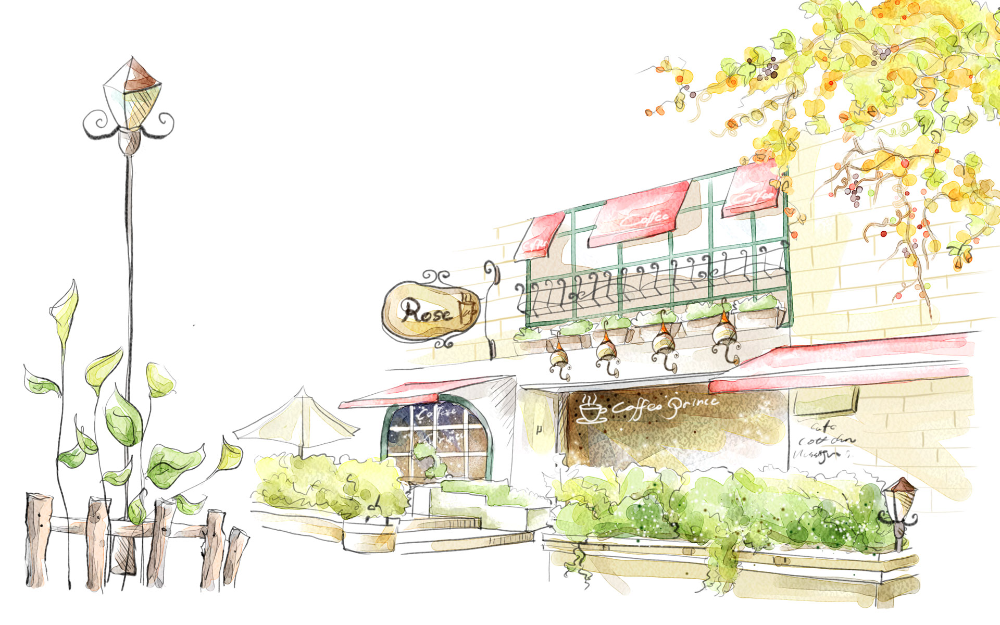

## 简介

轮播效果实现，依赖于jQuery,默认样式为全屏轮播，如有需要可自定义样式。

在线示例：http://yangxiaofu.com/compents/galler/index.html

## 如何使用

1. HTML结构

```html
<div class="page-wrapp">
	<div class="item-wrap">
		<div class="sub-item"></div>
		<div class="sub-item"></div>
		<div class="sub-item"></div>
		<div class="sub-item"></div>
		<div class="sub-item"></div>
	</div>
</div>

轮播导航按钮，data-index与图片对应
<ul id="silderNav">
    <li class="silder-index active" data-index='1'>1</li>
    <li class="silder-index" data-index='2'>2</li>
    <li class="silder-index" data-index='3'>3</li>
    <li class="silder-index" data-index='4'>4</li>
    <li class="silder-index" data-index='5'>5</li>
</ul>
```

带索引的HTML结构

```html
<div class="sub-item" data-index='1'>
    
</div>
<div class="sub-item" data-index='2'>
    
</div>
<div class="sub-item" data-index='3'>
    
</div>
<div class="sub-item" data-index='4'>
    
</div>
<div class="sub-item" data-index='5'>
    
</div>
```

默认结构为三次，轮播元素为5个，轮播图可放在.sub-item之下，即

```html
<div class="subitem">
	
</div>
```
这样就添加了一张图片元素


2. 自定义样式，在main.css之后引入

* 给page-wrapp设宽高

```css
.page-wrapp{
	/*调整位置可在此设置*/
	position: relative;
	/*轮播外层框架宽高设置*/
	width: 500px;
	height: 400px;
}

.page-wrapp .item-wrap{
	/*宽度默认为500%(若有4个子元素，则改为400%)
	高度默认为100%*/
	width: 500%;
}
```

3. 脚本引入

按顺序引入jquery、slider.js,路径可自定义

```javascript
<script src="./js/jquery-2.1.4"></script>
<script src="./js/slider.js"></script>
```

## 自定义class,id

```javascript
/*依次为左按钮、右按钮、轮播容器id以及每一个轮播元素class、轮播导航class*/
Slider = {
	leftBtn: '#leftBtn',	
	rightBtn: '#rightBtn',
	itemWrap: '#itemWrap',
	subItem: '#itemWrap .sub-item',
	silderIndexs: '.silder-index'
}
```

如果自定义id/class可传人一个如上的对象

```javascript
/*将第二层的容器改为 id="galleryWrap",
子元素改为 class="img-item",
以及按钮id更改。
注：只能改名，不能将id更改为class或是反过来*/
var mySlider = {
	leftBtn: '#leftButton',	
	rightBtn: '#rightButton',
	itemWrap: '#galleryWrap',
	subItem: '#galleryWrap .img-item',
	silderIndexs: '.silder-index'
}
/*初始化时作为参数传入*/
$(function(){
	Silder.init();
})```
